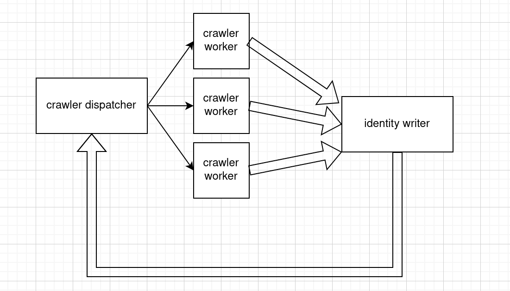

# Architecture

**This document describes the high-level architecture of this project**

If you want to familiarize yourself with the code base and _generally_ how it works, this is a good place to be.

## Overview

This uses a modified pipeline model.
There are 3 entities that we care about.
`crawler dispatcher`, `crawler worker`, and `identity writer`.

fat arrows are channels. thin arrows are spawns.

        

### `crawler dispatcher`

reads from the `URL queue` and spawn a worker to scrape the data.

### `crawler worker`

scrapes website at `url`.
finds all the `a` tags with `href`.
writes all the links it finds to `identity queue`

### `identity writer`

reads from `identity queue`.
if it hasnt been seen before,
write it to the `URL queue` and then write its id out.
else just write its id out.

## Code Map

#### Code Map Legend

`<file name>` for a file name

`<folder name>/` for a folder

`<folder name>/<file name>` for a file within a folder

### `Cargo.toml`

project settings

### `src/`

code lives here

### `src/main.rs`

main entry point for flytrap. also hold command logic and application base.

### `src/crawler.rs`

home of the crawler modules. This includes `crawler dispatch` and `crawler worker`

### `src/identity.rs`

home of identity module. This includes `identity writer`
